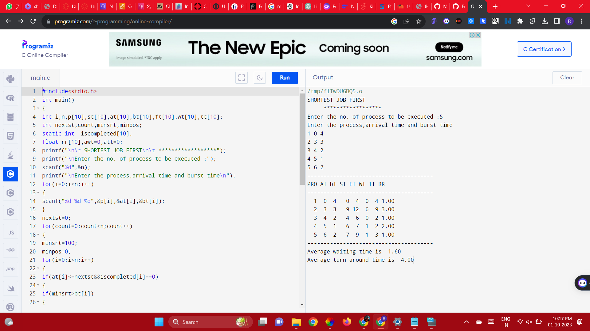
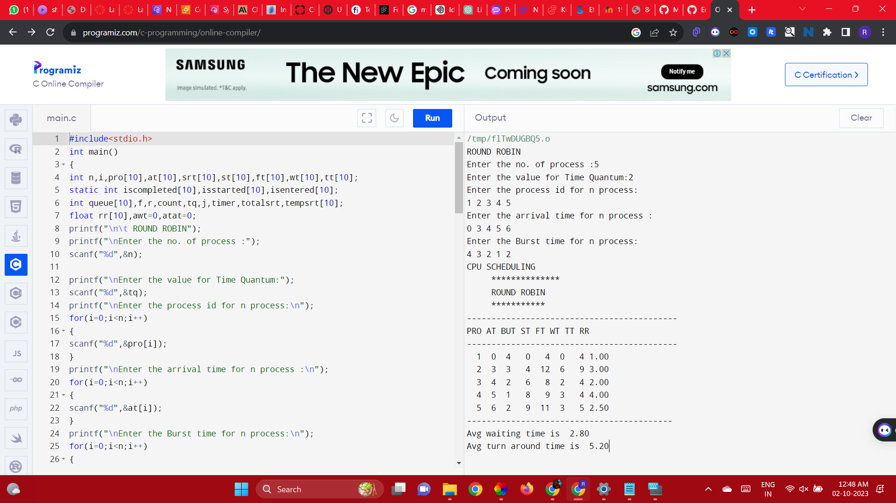
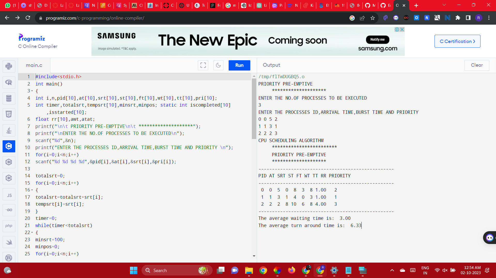
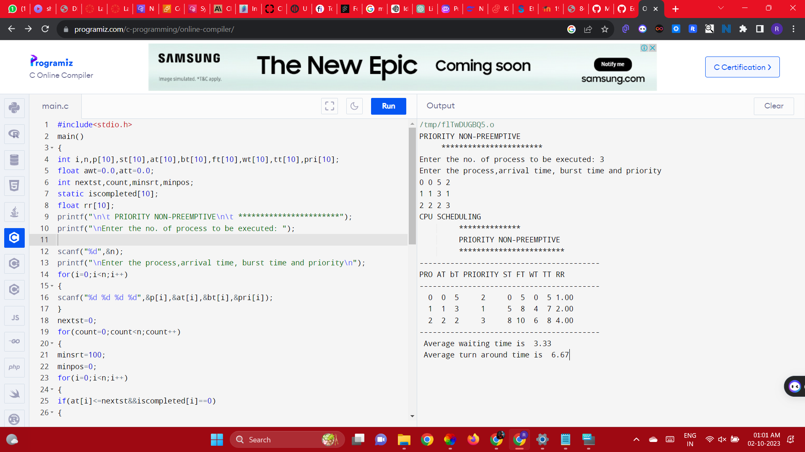

# EX.5-IMPLEMENTATION-OF-CPU-SCHEDULING-ALGORITHMS

## AIM: 

To implement First-Come-First-Serve (FCFS) Scheduling

## ALGORITHM:

Step 1: Start the process
Step 2: Accept the number of processes in the ready Queue
Step 3: For each process in the ready Q, assign the process id and accept the CPU burst
time
Step 4: Set the waiting of the first process as „0‟ and its burst time as its turn around
time
Step 5: for each process in the Ready Q calculate
  (a) Waiting time for process(n)= waiting time of process (n-1) + Burst time of
  process(n-1)
  (b) Turn around time for Process(n)= waiting time of Process(n)+ Burst time
  for process(n)
Step 6: Calculate
  (a) Average waiting time = Total waiting Time / Number of process
  (b) Average Turnaround time = Total Turnaround Time / Number of
process 
Step 7: Stop the process

## PROGRAM:
```
#include<stdio.h>
int main()
{
int c=0,i,n,bt[10],at[10],wt[10],ft[10];
int st[10],tat[10];
float awt=0,atat=0,rr[10];
printf("Enter the number of process : ");
scanf("%d",&n);
for(i=1;i<=n;i++)
{
printf("Enter the arrival time and burst time for the process %d ",i);
scanf("%d %d",&at[i],&bt[i]);


}
for(i=1;i<=n;i++)
{
st[i]=c;
c=c+bt[i];
wt[i]=st[i]-at[i];
ft[i]=st[i]+bt[i];
tat[i]=wt[i]+bt[i];
rr[i]=tat[i]/bt[i];
}
for(i=1;i<=n;i++)
{
awt=awt+wt[i];
atat=atat+tat[i];
}
awt=awt/n;
atat=atat/n;
printf("\n\t\t CPU SCHEDULING\n\t\t ***************");
printf("\n\t\t FIRST COME FIRST SERVE\n\t\t **********************");
printf("\n--------------------------------------------------------------\n");
printf("proc\t at\t bt\t st\t ft\t wt\t tat\t rr\t\n");
printf("--------------------------------------------------------------");
for(i=1;i<=n;i++)
{
printf("\n %d\t %d\t %d\t %d\t %d\t %d\t %d\t%5.2f",i,at[i],bt[i],st[i],ft[i],wt[i],tat[i],rr[i]);
}
printf("\n--------------------------------------------------------------");
printf("\n Average waiting time is %5.2f\n average tat is%5.2f",awt,atat); }
```
## OUTPUT:


## RESULT: 

First-Come-First-Serve Scheduling is implemented successfully.

## AIM: 

To implement Shortest Job First (SJF) Preemptive Scheduling

## ALGORITHM:

Step 1: Start the process
Step 2: Accept the number of processes in the ready Queue
Step 3: For each process in the ready Q, assign the process id and accept the CPU burst
time
Step 4: Start the Ready Q according the shortest Burst time by sorting according to
lowest to highest burst time.
Step 5: Set the waiting time of the first process as „0‟ and its turnaround time as its
burst time.
Step 6: For each process in the ready queue, calculate
  (a) Waiting time for process(n)= waiting time of process (n-1) + Burst time of
  process(n-1)
  (b) Turn around time for Process(n)= waiting time of Process(n)+ Burst time
  for process(n)
  (c) Average waiting time = Total waiting Time / Number of process
  (d) Average Turnaround time = Total Turnaround Time / Number of
  process 
Step 7: Stop the process

## PROGRAM:
```
#include<stdio.h>
int main()
{
int i,n,p[10],st[10],at[10],bt[10],ft[10],wt[10],tt[10];
int nextst,count,minsrt,minpos;
static int  iscompleted[10];
float rr[10],awt=0,att=0;
printf("\n\t SHORTEST JOB FIRST\n\t ******************");
printf("\nEnter the no. of process to be executed :");
scanf("%d",&n);
printf("\nEnter the process,arrival time and burst time\n");
for(i=0;i<n;i++)
{
scanf("%d %d %d",&p[i],&at[i],&bt[i]);
}
nextst=0;
for(count=0;count<n;count++)
{
minsrt=100;
minpos=0;
for(i=0;i<n;i++)
{
if(at[i]<=nextst&&iscompleted[i]==0)
{
if(minsrt>bt[i])
{
minsrt=bt[i];
minpos=i;
}
}
}
i=minpos;
st[i]=nextst;
ft[i]=st[i]+bt[i];
wt[i]=st[i]-at[i];
tt[i]=wt[i]+bt[i];
rr[i]=tt[i]/bt[i];
iscompleted[i]=1;
nextst=ft[i];
}
printf("\n---------------------------------------");
printf("\nPRO AT bT ST FT WT TT RR \n");
printf("---------------------------------------\n");
for(i=0;i<n;i++)
{
printf("%3d %2d %2d",p[i],at[i],bt[i]);
printf(" %3d %2d %2d %2d %4.2f\n",st[i],ft[i],wt[i],tt[i],rr[i]);
}
printf("---------------------------------------");
for(i=0;i<n;i++)
{
awt=awt+wt[i];
att=att+tt[i];
}
awt=awt/n;
att=att/n;
printf("\nAverage waiting time is %5.2f",awt);
printf("\nAverage turn around time is %5.2f",att);
}

```
## OUTPUT:



## RESULT: 

Shortest Job First (SJF) preemptive scheduling is implemented successfully.

## AIM: 

To implement Shortest Job First (SJF) Non-Preemptive Scheduling

## ALGORITHM:


## PROGRAM:
```

```
## OUTPUT:


## RESULT: 

Shortest Job First (SJF) Non-preemptive scheduling is implemented successfully.

## AIM: 

To implement Round Robin (RR) Scheduling

## ALGORITHM:

Step 1: Start the process
Step 2: Accept the number of processes in the ready Queue and time quantum (or) time
slice
Step 3: For each process in the ready Q, assign the process id and accept the CPU burst
time
Step 4: Calculate the no. of time slices for each process where
No. of time slice for process(n) = burst time process(n)/time slice
Step 5: If the burst time is less than the time slice then the no. of time slices =1.
Step 6: Consider the ready queue is a circular Q, calculate
  (a) Waiting time for process(n) = waiting time of process(n-1)+ burst time of
  process(n-1 ) + the time difference in getting the CPU from process(n-1)
  (b) Turn around time for process(n) = waiting time of process(n) + burst time
  of process(n)+ the time difference in getting CPU from process(n).
  (c) Average waiting time = Total waiting Time / Number of process
  (d) Average Turnaround time = Total Turnaround Time / Number of
  process. 
Step 8: Stop the process

## PROGRAM:
```
#include<stdio.h>
int main()
{
int n,i,pro[10],at[10],srt[10],st[10],ft[10],wt[10],tt[10];
static int iscompleted[10],isstarted[10],isentered[10];
int queue[10],f,r,count,tq,j,timer,totalsrt,tempsrt[10];
float rr[10],awt=0,atat=0;
printf("\n\t ROUND ROBIN");
printf("\nEnter the no. of process :");
scanf("%d",&n);

printf("\nEnter the value for Time Quantum:");
scanf("%d",&tq);
printf("\nEnter the process id for n process:\n");
for(i=0;i<n;i++)
{
scanf("%d",&pro[i]);
}
printf("\nEnter the arrival time for n process :\n");
for(i=0;i<n;i++)
{
scanf("%d",&at[i]);
}
printf("\nEnter the Burst time for n process:\n");
for(i=0;i<n;i++)
{
scanf("%d",&srt[i]);
}
totalsrt=0;
for(i=0;i<n;i++)
{
totalsrt=totalsrt+srt[i];
tempsrt[i]=srt[i];
}
f=0;
r=-1;
count=0;
timer=0;
for(i=0;i<n;i++)
{
if(at[i]==0)
{
r=(r+1)%n;
queue[r]=i;
isentered[i]=1;
count=count+1;
}
}
while(timer<totalsrt)
{
j=queue[f];
f=(f+1)%n;
if(isstarted[j]==0)
{
st[j]=timer;
wt[j]=st[j]-at[j];
isstarted[j]=1;
}
if(srt[j]>=tq)

{
timer=timer+tq;
srt[j]=srt[j]-tq;
}
else
{
timer=timer+srt[j];
srt[j]=srt[j]-srt[j];
}
if(srt[j]==0)
{
ft[j]=timer;
wt[j]=wt[j]+(ft[j]-(st[j]+tempsrt[j]));
tt[j]=wt[j]+tempsrt[j];
rr[j]=(float)tt[j]/tempsrt[j];
iscompleted[j]=1;
}
for(i=0;i<n&&count<n;i++)
{
if(at[i]<=timer&&isentered[i]==0)
{
r=(r+1)%n;
queue[r]=i;
isentered[i]=1;
count=count+1;
}
}
if(iscompleted[j]==0)
{
r=(r+1)%n;
queue[r]=j;
}
}
printf("\n\t CPU SCHEDULING\n\t **************");
printf("\n\t ROUND ROBIN\n\t ***********\n");
printf("------------------------------------------- \n");
printf("PRO AT BUT ST FT WT TT RR");
printf("\n------------------------------------------- \n");
for(i=0;i<n;i++)
{
printf("%3d %2d %2d",pro[i],at[i],tempsrt[i]);
printf(" %3d %3d %2d",st[i],ft[i],wt[i]);
printf(" %3d %4.2f\n",tt[i],rr[i]);
}
printf("------------------------------------------ ");

for(i=0;i<n;i++)
{
awt=awt+wt[i];
atat=atat+tt[i];
}
awt=awt/n;
atat=atat/n;
printf("\nAvg waiting time is %5.2f ",awt );
printf("\nAvg turn around time is %5.2f",atat);
}

```
## OUTPUT:



## RESULT: 

Round Robin (RR) Scheduling is implemented successfully.


## AIM: 

To implement Priority Preemptive Scheduling

## ALGORITHM:

Step 1: Start the process
Step 2: Accept the number of processes in the ready Queue
Step 3: For each process in the ready Q, assign the process id and accept the CPU burst
time
Step 4: Start the Ready Q according the priority number given to the processes by
sorting according to the highest priority to lowest
Step 5: Set the waiting time of the first process as „0‟ and its turnaround time as its
burst time.
Step 6: For each process in the ready queue, calculate
  (a) Waiting time for process(n)= waiting time of process (n-1) + Burst time of
  process(n-1)
  (b) Turn around time for Process(n)= waiting time of Process(n)+ Burst time
  for process(n)
  (c) Average waiting time = Total waiting Time / Number of process
  (d) Average Turnaround time = Total Turnaround Time / Number of
  process. 
Step 7: Stop the process

## PROGRAM:
```
#include<stdio.h>
int main()
{
int i,n,pid[10],at[10],srt[10],st[10],ft[10],wt[10],tt[10],pri[10];
int timer,totalsrt,tempsrt[10],minsrt,minpos; static int iscompleted[10],isstarted[10];
float rr[10],awt,atat;
printf("\n\t PRIORITY PRE-EMPTIVE\n\t ********************");
printf("\nENTER THE NO.OF PROCESSES TO BE EXECUTED\n");
scanf("%d",&n);
printf("ENTER THE PROCESSES ID,ARRIVAL TIME,BURST TIME AND PRIORITY \n");
for(i=0;i<n;i++)
scanf("%d %d %d %d",&pid[i],&at[i],&srt[i],&pri[i]);

totalsrt=0;
for(i=0;i<n;i++)
{
totalsrt=totalsrt+srt[i];
tempsrt[i]=srt[i];
}
timer=0;
while(timer<totalsrt)
{
minsrt=100;
minpos=0;
for(i=0;i<n;i++)
{
if(at[i]<=timer && iscompleted[i]==0)
{
if(minsrt>pri[i])
{
minsrt=pri[i];
minpos=i;
}
}
}
i=minpos;
if(isstarted[i]==0)
{
st[i]=timer;
wt[i]=st[i]-at[i];
isstarted[i]=1;
}
srt[i]=srt[i]-1;
timer=timer+1;
if(srt[i]==0)
{
ft[i]=timer;
wt[i]=wt[i]+(ft[i]-(st[i]+tempsrt[i]));
tt[i]=wt[i]+tempsrt[i];
rr[i]=tt[i]/tempsrt[i];
iscompleted[i]=1;
}
}
printf("\n\t CPU SCHEDULING ALGORITHM\n\t ************************");
printf("\n\t PRIORITY PRE-EMPTIVE\n\t ********************");
printf("\n--------------------------------------------------");
printf("\nPID AT SRT ST FT WT TT RR PRIORITY\n");
printf("--------------------------------------------------\n");
for(i=0;i<n;i++)
{
printf("%2d %2d %2d ",pid[i],at[i],tempsrt[i]);
printf("%2d %2d %2d %2d %2.2f %3d\n",st[i],ft[i],wt[i],tt[i],rr[i],pri[i]);

}
printf("--------------------------------------------------\n");
for(i=0;i<n;i++)
{
awt=awt+wt[i];
atat=atat+tt[i];
}
atat=atat/n;
awt=awt/n;
printf("The average waiting time is: %5.2f\n",awt);
printf("The average turn around time is: %5.2f",atat);
}
```
## OUTPUT:



## RESULT: Priority Preemptive scheduling is implemented successfully.


## AIM: 

To implement Priority Non-Preemptive Scheduling

## ALGORITHM:

Step 1: Start the process
Step 2: Accept the number of processes in the ready Queue
Step 3: For each process in the ready Q, assign the process id and accept the CPU burst
time
Step 4: Start the Ready Q according the priority number given to the processes by
sorting according to the highest priority to lowest
Step 5: Set the waiting time of the first process as „0‟ and its turnaround time as its
burst time.
Step 6: For each process in the ready queue, calculate
  (a) Waiting time for process(n)= waiting time of process (n-1) + Burst time of
  process(n-1)
  (b) Turn around time for Process(n)= waiting time of Process(n)+ Burst time
  for process(n)
  (c) Average waiting time = Total waiting Time / Number of process
  (d) Average Turnaround time = Total Turnaround Time / Number of
  process. 
Step 7: Stop the process


## PROGRAM:
```
#include<stdio.h>
main()
{
int i,n,p[10],st[10],at[10],bt[10],ft[10],wt[10],tt[10],pri[10];
float awt=0.0,att=0.0;
int nextst,count,minsrt,minpos;
static iscompleted[10];
float rr[10];
printf("\n\t PRIORITY NON-PREEMPTIVE\n\t ***********************");
printf("\nEnter the no. of process to be executed: ");
scanf("%d",&n);
printf("\nEnter the process,arrival time, burst time and priority\n");
for(i=0;i<n;i++)
{
scanf("%d %d %d %d",&p[i],&at[i],&bt[i],&pri[i]);
}
nextst=0;
for(count=0;count<n;count++)
{
minsrt=100;
minpos=0;
for(i=0;i<n;i++)
{
if(at[i]<=nextst&&iscompleted[i]==0)
{
if(minsrt>pri[i])
{
minsrt=pri[i];
minpos=i;
}
}
}
i=minpos;
st[i]=nextst;
ft[i]=st[i]+bt[i];
wt[i]=st[i]-at[i];
tt[i]=wt[i]+bt[i];
rr[i]=tt[i]/bt[i];
iscompleted[i]=1;
nextst=ft[i];
}
printf("\n\t\t CPU SCHEDULING\n\t\t **************");
printf("\n\t\t PRIORITY NON-PREEMPTIVE\n\t\t ************************");
printf("\n-----------------------------------------");
printf("\nPRO AT bT PRIORITY ST FT WT TT RR \n");
printf("-----------------------------------------\n");
for(i=0;i<n;i++)
{
printf("%3d %2d %2d %5d",p[i],at[i],bt[i],pri[i]);
printf(" %5d %2d %2d %2d %4.2f\n",st[i],ft[i],wt[i],tt[i],rr[i]);
}
printf("-----------------------------------------");
for(i=0;i<n;i++)
{
awt=awt+wt[i];
att=att+tt[i];
}
awt=awt/n;
att=att/n;
printf("\n Average waiting time is %5.2f",awt);
printf("\n Average turn around time is %5.2f",att);
}
```
## OUTPUT:



## RESULT: 

Priority Non-preemptive scheduling is implemented successfully.

